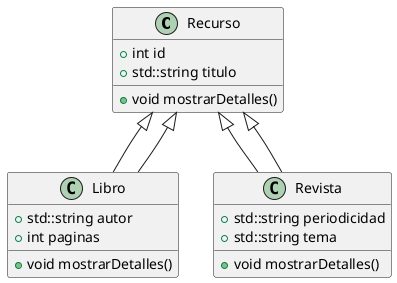

# Avance

Primer Avance #Descripción Completa del Proyecto: Biblioteca Digital El objetivo es
desarrollar una aplicación básica para gestionar una biblioteca digital. La biblioteca
contiene diferentes tipos de recursos (libros, revistas y videos), cada uno con atributos
específicos. La aplicación ofrecerá la capacidad de añadir, mostrar y administrar estos
recursos.

# Biblioteca Digital

## Descripción

Este proyecto consiste en crear una aplicación para gestionar una biblioteca digital. En
ella se pueden almacenar y gestionar diferentes tipos de recursos: libros, revistas y
videos. Cada tipo de recurso tiene características específicas que permiten identificarlo
de manera única.

## Problema

Hoy en día, los recursos digitales se encuentran dispersos en diversas plataformas,
dificultando su acceso y consulta rápida. Con esta biblioteca digital, se busca
centralizar y organizar los recursos en un solo lugar.

## Objetivo del Programa

El programa permite:

1. Agregar diferentes tipos de recursos a la biblioteca digital (libros, revistas,
   videos).
2. Consultar información específica de cada recurso.
3. Visualizar una lista básica de los recursos almacenados.

## Uso del Programa

El usuario puede interactuar con el programa de la siguiente manera:

1. Crear un recurso específico (por ejemplo, un libro).
2. Consultar la información del recurso creado.
3. Expander la biblioteca digital agregando más recursos.

## Compilar el programa

1. Corre en la terminal de tu preferencia el siguiente comando ''' g++ main.cpp -o
   biblioteca '''
2. Ejecuta el programa ''' ./biblioteca '''

## Diagrama de clases


En el diagrama podemos ver como la clase de "Recurso" es la clase padre, el cual contiene
como elementos privados el tipo de contenido, que es en cadena de texto, el tipo de
identificador y el tipo de dato del título, en este caso, como una cadena de texto. Las
clases "Libro" y "Revista" hereden toda la functionalidad y logica del padre, lo que ayuda
a evitar el codigo duplicado en el programa. La clase "Biblioteca" tambien esta compuesta
de un vector de Recursos, es decir, libros y revitas, al ambas clases hijas heredar la
funcion del padre esto nos permite usarlas de forma intercambiada, encapsulando la
informacion y logica de cada tipo. Ademas, gracias a esta herencia la clase de Biblioteca
puede ser extendida a que contenga otros tipos de Recursos sin tener que modificar la
clase Biblioteca.

Como los hijos heredan toda la lógica del padre, solo se debe sobreescribir aquel
comportamiento que debe ser especializado en cada caso, por ejemplo, la forma en la que se
despliegan los detalles de cada clase debera ser diferente, pero ambas clases seguiran
siendo hijos de Recurso.

# Guía de Uso de la Interfaz del Sistema de Biblioteca Virtual

La interfaz del sistema de biblioteca virtual te permite interactuar con una colección de
libros y revistas mediante un menú de opciones accesible desde la línea de comandos. A
continuación, se describe cómo utilizar cada opción del menú y se presentan detalles sobre
los posibles errores y limitaciones que podrías encontrar.

## Opciones Disponibles en la Línea de Comandos

### 1. Mostrar todos los recursos

Muestra todos los recursos disponibles (libros y revistas) en la biblioteca, siempre y
cuando ya hayan sido creados. Los recursos se presentan con sus informaciones respectivas.

- **No requiere parámetros adicionales**.

### 2. Buscar libro por ID

Permite buscar un libro mediante su identificador (ID).

- **Parámetro necesario**: ID (debe ser un número entero positivo).
- **Limitaciones**: Si se introduce un ID que no corresponde a ningún recurso existente,
  se mostrará un mensaje indicando "Libro no encontrado".

### 3. Buscar revista por ID

Permite buscar una revista mediante su identificador (ID).

- **Parámetro necesario**: ID (debe ser un número entero positivo).
- **Limitaciones**: Si se introduce un ID que no corresponde a ninguna revista existente,
  se mostrará un mensaje indicando "Revista no encontrada".

### 4. Contar recursos

Muestra el total de recursos actualmente disponibles en la biblioteca.

- **No requiere parámetros adicionales**.

### 5. Crear nuevo libro

Permite agregar un nuevo libro a la biblioteca. Solicita varios parámetros para crear el
recurso.

- **Parámetros necesarios**:
  - **Contenido**: Cadena de texto con el contenido del libro.
  - **ID**: Número entero positivo único para identificar el libro.
  - **Título**: Título del libro.
  - **Género**: Género literario del libro.
  - **Páginas**: Número entero que indica la cantidad de páginas del libro.
  - **Autor**: Autor del libro.
- **Limitaciones**: Si se ingresa un ID duplicado o un ID no numérico, no se podrá agregar
  el recurso. Además, es necesario proveer valores válidos y no vacíos para cada uno de
  los campos solicitados.

### 6. Crear nueva revista

Permite agregar una nueva revista a la biblioteca. Solicita varios parámetros para crear
el recurso.

- **Parámetros necesarios**:
  - **Contenido**: Cadena de texto con el contenido de la revista.
  - **ID**: Número entero positivo único para identificar la revista.
  - **Título**: Título de la revista.
  - **Periodicidad**: Cadena de texto que indica la periodicidad de la revista (por
    ejemplo, "mensual", "semanal").
  - **Páginas**: Número entero que indica la cantidad de páginas de la revista.
  - **Tema**: Tema principal de la revista.
- **Limitaciones**: Similar al libro, si se proporciona un ID duplicado o no válido, el
  recurso no será agregado. Es importante que todos los campos solicitados tengan un valor
  válido y no estén vacíos.

### 7. Mostrar solo libros

Muestra todos los libros disponibles en la biblioteca.

- **No requiere parámetros adicionales**.

### 8. Mostrar solo revistas

Muestra todas las revistas disponibles en la biblioteca.

- **No requiere parámetros adicionales**.

### 0. Salir

Termina la ejecución del programa.

- **No requiere parámetros adicionales**.

## Casos en los que el Programa No Funciona Correctamente

- Entrada no numérica en opciones del menú: Si el usuario ingresa un valor no numérico
  cuando se le solicita una opción del menú, el programa limpiará el input y solicitará
  que se seleccione una opción válida.

- \_ID no numerico: Si se intenta agregar un libro o revista con un ID que no sea un
  numero, el programa fallara.

- Campos vacíos: Todos los campos solicitados (título, autor, contenido, etc.) deben
  tener valores válidos. Si se ingresa un campo vacío, el comportamiento puede no ser el
  esperado.

- \_ID no existente para buscar: Si se intenta buscar o eliminar un recurso con un ID que
  no está registrado en la biblioteca, el programa indicará que el recurso no se ha
  encontrado.


## Notas Finales

Este sistema es una herramienta sencilla para gestionar una biblioteca virtual, que
permite almacenar y administrar tanto libros como revistas. Los usuarios deben asegurarse
de proporcionar valores válidos y seguir las instrucciones correctamente para evitar
errores durante la ejecución.

# Explicación de Conceptos Externos a la Clase

## Librerías

### Algorithm: `remove_if` y `find_if`

La librería `<algorithm>` en C++ contiene varias funciones que facilitan trabajar con
datos en contenedores como vectores. Dos funciones comunes son `std::remove_if` y
`std::find_if`:

- **`std::remove_if`**: Esta función reubica todos los elementos que cumplen con una
  condición al final del contenedor y devuelve un iterador apuntando al primer elemento
  "removido". Luego se usa `erase` para eliminar definitivamente esos elementos del
  contenedor.
- **`std::find_if`**: Busca el primer elemento en un rango que cumpla con una condición
  específica y devuelve un iterador apuntando a dicho elemento. Si no encuentra ninguno,
  devuelve un iterador que apunta al final del rango.

Anteriormente, esta libreria se usaba en el proyecto para realizar busquedas y operaciones
de eliminacion con apuntadores para simplificar el codigo del proyecto.

### Iostream

La librería `<iostream>` se usa para manejar la entrada y salida de datos en C++. Los
objetos **`std::cin`** y **`std::cout`** permiten leer datos del usuario y escribir
información en la consola, respectivamente. Es una de las librerías más básicas y
necesarias para interactuar con el usuario en cualquier programa en C++. Esta libreria se
uso en la clase Interfaz para leer instrucciones del usuario y mostrar en la terminal los
resultados de dichas instrucciones.

## Vectores

La clase **`std::vector`** es parte de la librería `<vector>`. Un vector es un contenedor
dinámico que puede almacenar una cantidad variable de elementos y cambiar su tamaño
automáticamente según sea necesario. A diferencia de los arreglos estáticos, los vectores
pueden crecer o reducirse en tiempo de ejecución, lo cual los hace muy útiles cuando no se
sabe de antemano cuántos elementos serán necesarios. Los vectores se usaron en este
proyecto dentro de la biblioteca para almacenar Libros y Recursos en colecciones que
pudieran crecer y que tuvieran metodos utiles como .size() para mantener constancia de su
longitud.

## Polimorfismo

El **polimorfismo** es una característica clave de la Programación Orientada a Objetos.
Permite que un mismo código funcione con diferentes tipos de objetos. En C++, el
polimorfismo se logra a través de **funciones virtuales**. Por ejemplo, si tienes una
clase base `Recurso` y clases derivadas como `Libro` y `Revista`, puedes tener un puntero
de tipo `Recurso` que apunte a un `Libro` o a una `Revista`, y cuando llames un método
virtual como `imprimirDetalles()`, se ejecutará la versión adecuada según el tipo del
objeto al que esté apuntando. Esto permite que el comportamiento sea más flexible y
adaptable. Originalmente la biblioteca almacenaba apuntadores compartidos de recursos,
permitiendo usar los metodos de Libros y Revistas de forma uniforme y almacenar estos
recursos de forma combinada.

## Herencia

**Herencia** es un concepto fundamental en la Programación Orientada a Objetos que permite
definir nuevas clases basadas en clases existentes. En C++, una clase derivada hereda
atributos y métodos de una clase base, lo cual ayuda a reutilizar el código y mantener una
estructura organizada. Por ejemplo, en una biblioteca, `Libro` y `Revista` pueden heredar
de una clase `Recurso`, compartiendo propiedades comunes como el título, el ID, o el
número de páginas. En este proyecto las clases Libro y Revista heredan de Recurso, esto
ayudo a simplificar el codigo y eliminar codigo duplicado entre ambas.

## Documentación

La **documentación** del código es esencial para que los desarrolladores (incluido tú
mismo) puedan entender cómo funciona el programa. En C++, se suelen usar comentarios con
`/** ... */` para documentar clases, métodos y atributos. Además, herramientas como
**Doxygen** permiten generar documentación automáticamente a partir de estos comentarios,
lo que facilita la colaboración y el mantenimiento de proyectos grandes.

### Plantilla de Documentación para C++

Para documentar de manera efectiva las clases y métodos en C++ de este proyecto se uso la
siguiente plantilla usando el estilo `Doxygen`:

```cpp
/**
 * @class NombreDeLaClase
 * @brief Descripción breve de la clase.
 *
 * Descripción más detallada sobre la clase, su propósito y cómo se utiliza.
 */
class NombreDeLaClase {
public:
    /**
     * @brief Descripción del constructor.
     *
     * Explica qué hace el constructor y los parámetros que recibe.
     *
     * @param parametro1 Descripción del primer parámetro.
     * @param parametro2 Descripción del segundo parámetro.
     */
    NombreDeLaClase(int parametro1, std::string parametro2);

    /**
     * @brief Método para realizar una acción específica.
     *
     * Descripción detallada de lo que hace el método.
     *
     * @return Devuelve un valor que indica el resultado de la operación.
     */
    int metodoEjemplo();
};
```

Este estilo de documentación ayuda a generar archivos HTML o PDF que describen claramente
cómo usar cada parte del código.

## Apuntadores, Referencias y Apuntadores Compartidos

- **Apuntadores (`*`)**: Son variables que almacenan la dirección de memoria de otra
  variable. Aunque son muy poderosos, requieren una gestión manual de la memoria, como el
  uso de `new` para asignar y `delete` para liberar la memoria.
- **Referencias (`&`)**: Son básicamente un alias para otra variable existente. A
  diferencia de los apuntadores, no necesitan gestión manual de la memoria y son más
  seguras porque no pueden ser nulas (`nullptr`). Se usan principalmente para evitar
  copias innecesarias y para modificar variables dentro de funciones.
- **`std::shared_ptr`**: Es un **puntero inteligente** que gestiona automáticamente la
  memoria mediante un **contador de referencias**. Esto significa que cuando un
  `std::shared_ptr` deja de apuntar a un recurso y ya no hay ninguna otra referencia al
  mismo, el recurso se libera automáticamente. Esto es muy útil para evitar fugas de
  memoria y asegurar una gestión segura y eficiente.

## PlantUML

**PlantUML** es una herramienta que se utiliza para crear diagramas a partir de texto.
Esto es particularmente útil para visualizar la estructura de un proyecto orientado a
objetos, como **diagramas de clases**, **diagramas de secuencia**, o **diagramas de
actividad**. Los diagramas de clases, por ejemplo, muestran cómo están relacionadas las
diferentes clases entre sí, lo cual es útil para entender herencia, composición y otras
relaciones importantes. PlantUML puede integrarse con muchas herramientas de desarrollo
para facilitar la generación de diagramas en tiempo real a medida que trabajas en el
código.

### Ejemplo de Sintaxis para Diagramas de Clases en PlantUML

A continuación, un ejemplo de cómo se escribe la sintaxis de un diagrama de clases en
PlantUML:



- **`@startuml` y `@enduml`**: Indican el inicio y el fin del diagrama.
- **`class`**: Define una clase con sus atributos (`+` indica público) y métodos.
- **`Recurso <|-- Libro`**: Muestra una relación de **herencia** donde `Libro` hereda de
  `Recurso`.
- En el ejemplo, `Recurso` es la clase base y `Libro` y `Revista` son clases derivadas que
  heredan sus atributos y métodos, lo cual se refleja en el diagrama.

PlantUML hace que sea fácil entender la estructura de tus clases y cómo interactúan entre
sí, lo cual es particularmente útil para la planificación y el diseño de software. Esta
herramienta se uso para modelar el diagrama de clases de este proyecto.


# Bibliografía

Curry, C. (2019, 24 de julio). C++ Programming All-in-One Tutorial Series (10 HOURS!) 
[Video].YouTube. https://www.youtube.com/watch?v=_bYFu9mBnr4

Miro. (s.f.). Quick Guide to PlantUML: Diagrams, Syntax & Best Practices. 
Recuperado de https://miro.com/diagramming/what-is-plantuml/

GeeksforGeeks. (2023, octubre 10). std::remove_if in C++ STL. GeeksforGeeks. 
Recuperado de https://www.geeksforgeeks.org/std-remove-if-algorithm-in-cpp-stl/

GeeksforGeeks. (s.f.). std::find_if, std::find_if_not in C++. 
Recuperado de https://www.geeksforgeeks.org/stdfind_if-stdfind_if_not-in-c/
