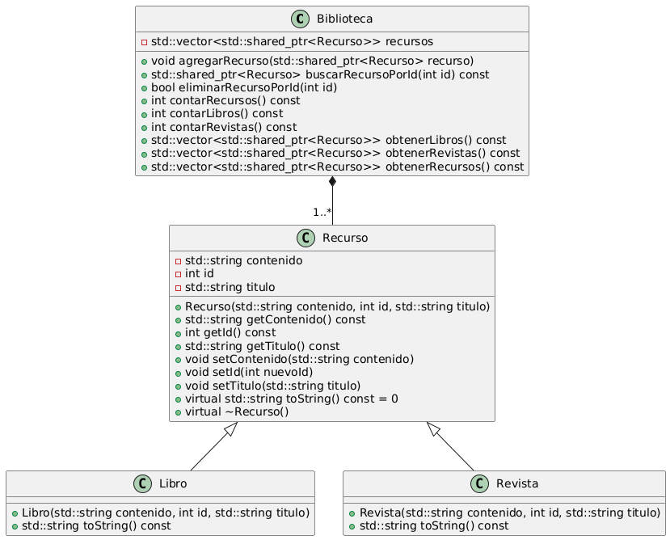

# Avance
Primer Avance
#Descripción Completa del Proyecto: Biblioteca Digital
El objetivo es desarrollar una aplicación básica para gestionar una biblioteca digital. La biblioteca contiene diferentes tipos de recursos (libros, revistas y videos), cada uno con atributos específicos. La aplicación ofrecerá la capacidad de añadir, mostrar y administrar estos recursos.

# Biblioteca Digital

## Descripción
Este proyecto consiste en crear una aplicación para gestionar una biblioteca digital. En ella se pueden almacenar y gestionar diferentes tipos de recursos: libros, revistas y videos. Cada tipo de recurso tiene características específicas que permiten identificarlo de manera única.

## Problema
Hoy en día, los recursos digitales se encuentran dispersos en diversas plataformas, dificultando su acceso y consulta rápida. Con esta biblioteca digital, se busca centralizar y organizar los recursos en un solo lugar.

## Objetivo del Programa
El programa permite:
1. Agregar diferentes tipos de recursos a la biblioteca digital (libros, revistas, videos).
2. Consultar información específica de cada recurso.
3. Visualizar una lista básica de los recursos almacenados.

## Uso del Programa
El usuario puede interactuar con el programa de la siguiente manera:
1. Crear un recurso específico (por ejemplo, un libro).
2. Consultar la información del recurso creado.
3. Expander la biblioteca digital agregando más recursos.

## Compilar el programa
1. Corre en la terminal de tu preferencia el siguiente comando
'''
g++ main.cpp -o biblioteca
'''
2. Ejecuta el programa
'''
./biblioteca
'''

## Diagrama de clases

En el diagrama podemos ver como la clase de "Recurso" es la clase padre, el cual contiene como elementos privados el tipo de contenido, que es en cadena de texto, el tipo de identificador y el tipo de dato del título, en este caso, como una cadena de texto. Las clases "Libro" y "Revista" hereden toda la functionalidad y logica del padre, lo que ayuda a evitar el codigo duplicado en el programa. La clase "Biblioteca" tambien esta compuesta de un vector de Recursos, es decir, libros y revitas, al ambas clases hijas heredar la funcion del padre esto nos permite usarlas de forma intercambiada, encapsulando la informacion y logica de cada tipo. Ademas, gracias a esta herencia la clase de Biblioteca puede ser extendida a que contenga otros tipos de Recursos sin tener que modificar la clase Biblioteca.

Como los hijos heredan toda la lógica del padre, solo se debe sobreescribir aquel comportamiento que debe ser especializado en cada caso, por ejemplo, la forma en la que se despliegan los detalles de cada clase debera ser diferente, pero ambas clases seguiran siendo hijos de Recurso.
