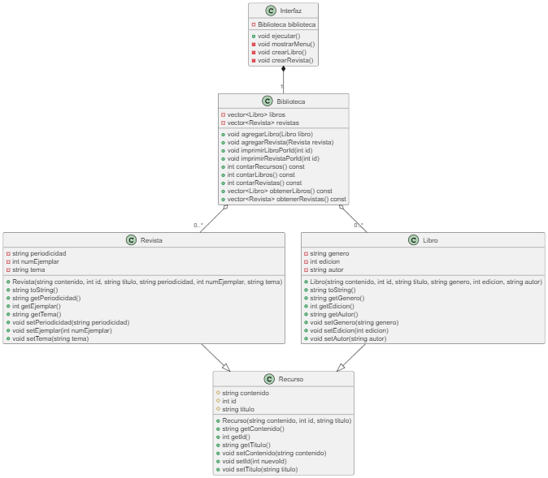

# Avance
Primer Avance
#Descripción Completa del Proyecto: Biblioteca Digital
El objetivo es desarrollar una aplicación básica para gestionar una biblioteca digital. La biblioteca contiene diferentes tipos de recursos (libros, revistas y videos), cada uno con atributos específicos. La aplicación ofrecerá la capacidad de añadir, mostrar y administrar estos recursos.

# Biblioteca Digital

## Descripción
Este proyecto consiste en crear una aplicación para gestionar una biblioteca digital. En ella se pueden almacenar y gestionar diferentes tipos de recursos: libros, revistas y videos. Cada tipo de recurso tiene características específicas que permiten identificarlo de manera única.

## Problema
Hoy en día, los recursos digitales se encuentran dispersos en diversas plataformas, dificultando su acceso y consulta rápida. Con esta biblioteca digital, se busca centralizar y organizar los recursos en un solo lugar.

## Objetivo del Programa
El programa permite:
1. Agregar diferentes tipos de recursos a la biblioteca digital (libros, revistas, videos).
2. Consultar información específica de cada recurso.
3. Visualizar una lista básica de los recursos almacenados.

## Uso del Programa
El usuario puede interactuar con el programa de la siguiente manera:
1. Crear un recurso específico (por ejemplo, un libro).
2. Consultar la información del recurso creado.
3. Expander la biblioteca digital agregando más recursos.

## Compilar el programa
1. Corre en la terminal de tu preferencia el siguiente comando
'''
g++ main.cpp -o biblioteca
'''
2. Ejecuta el programa
'''
./biblioteca
'''

## Diagrama de clases

En el diagrama podemos ver como la clase de "Recurso" es la clase padre, el cual contiene como elementos privados el tipo de contenido, que es en cadena de texto, el tipo de identificador y el tipo de dato del título, en este caso, como una cadena de texto. Las clases "Libro" y "Revista" hereden toda la functionalidad y logica del padre, lo que ayuda a evitar el codigo duplicado en el programa. La clase "Biblioteca" tambien esta compuesta de un vector de Recursos, es decir, libros y revitas, al ambas clases hijas heredar la funcion del padre esto nos permite usarlas de forma intercambiada, encapsulando la informacion y logica de cada tipo. Ademas, gracias a esta herencia la clase de Biblioteca puede ser extendida a que contenga otros tipos de Recursos sin tener que modificar la clase Biblioteca.

Como los hijos heredan toda la lógica del padre, solo se debe sobreescribir aquel comportamiento que debe ser especializado en cada caso, por ejemplo, la forma en la que se despliegan los detalles de cada clase debera ser diferente, pero ambas clases seguiran siendo hijos de Recurso.

# Guía de Uso de la Interfaz del Sistema de Biblioteca Virtual

La interfaz del sistema de biblioteca virtual te permite interactuar con una colección de libros y revistas mediante un menú de opciones accesible desde la línea de comandos. A continuación, se describe cómo utilizar cada opción del menú y se presentan detalles sobre los posibles errores y limitaciones que podrías encontrar.

## Opciones Disponibles en la Línea de Comandos

1. *Mostrar todos los recursos*: Esta opción muestra todos los recursos disponibles (libros y revistas) en la biblioteca, siempre y cuando ya esten creados. Los recursos se presentan con sus informaciones respectivas.

   - No requiere parámetros adicionales.

2. *Buscar recurso por ID*: Permite buscar un libro o revista mediante su identificador (ID).

   - *Parámetro necesario*: ID (debe ser un número entero positivo).
   - *Limitaciones*: Si se introduce un ID que no corresponde a ningún recurso existente, se mostrará un mensaje indicando "Recurso no encontrado".

3. *Eliminar recurso por ID*: Permite eliminar un libro o revista por su identificador.

   - *Parámetro necesario*: ID (debe ser un número entero positivo).
   - *Limitaciones*: Si el ID no coincide con ningún recurso en la biblioteca, se mostrará un mensaje de "Recurso no encontrado". 
4. *Contar recursos*: Muestra el total de recursos actualmente disponibles en la biblioteca.

   - No requiere parámetros adicionales.

5. *Crear nuevo libro*: Permite agregar un nuevo libro a la biblioteca. Solicita varios parámetros para crear el recurso.

   - *Parámetros necesarios*:
     - contenido: Cadena de texto con el contenido del libro.
     - ID: Número entero positivo único para identificar el libro.
     - título: Título del libro.
     - género: Género literario del libro.
     - páginas: Número entero que indica la cantidad de páginas del libro.
     - autor: Autor del libro.
   - *Limitaciones*: Si se ingresa un ID duplicado o un ID no numérico, no se podrá agregar el recurso. Además, es necesario proveer valores válidos y no vacíos para cada uno de los campos solicitados.

6. *Crear nueva revista*: Permite agregar una nueva revista a la biblioteca. Solicita varios parámetros para crear el recurso.

   - *Parámetros necesarios*:
     - contenido: Cadena de texto con el contenido de la revista.
     - ID: Número entero positivo único para identificar la revista.
     - título: Título de la revista.
     - periodicidad: Cadena de texto que indica la periodicidad de la revista (por ejemplo, "mensual", "semanal").
     - páginas: Número entero que indica la cantidad de páginas de la revista.
     - tema: Tema principal de la revista.
   - *Limitaciones*: Similar al libro, si se proporciona un ID duplicado o no válido, el recurso no será agregado. Es importante que todos los campos solicitados tengan un valor válido y no estén vacíos.

7. *Mostrar solo libros*: Muestra todos los libros disponibles en la biblioteca.

   - No requiere parámetros adicionales.

8. *Mostrar solo revistas*: Muestra todas las revistas disponibles en la biblioteca.

   - No requiere parámetros adicionales.

9. *Salir*: Termina la ejecución del programa.

   - No requiere parámetros adicionales.

## Casos en los que el Programa No Funciona Correctamente

- *Entrada no numérica en opciones del menú*: Si el usuario ingresa un valor no numérico cuando se le solicita una opción del menú, el programa limpiará el input y solicitará que se seleccione una opción válida.

- *ID duplicado*: Si se intenta agregar un libro o revista con un ID que ya existe, no se podrá agregar el nuevo recurso. Esto garantiza que los ID sean únicos.

- *Campos vacíos*: Todos los campos solicitados (título, autor, contenido, etc.) deben tener valores válidos. Si se ingresa un campo vacío, el comportamiento puede no ser el esperado.

- *ID no existente para buscar o eliminar*: Si se intenta buscar o eliminar un recurso con un ID que no está registrado en la biblioteca, el programa indicará que el recurso no se ha encontrado.

## Notas Finales

Este sistema es una herramienta sencilla para gestionar una biblioteca virtual, que permite almacenar y administrar tanto libros como revistas. Los usuarios deben asegurarse de proporcionar valores válidos y seguir las instrucciones correctamente para evitar errores durante la ejecución.